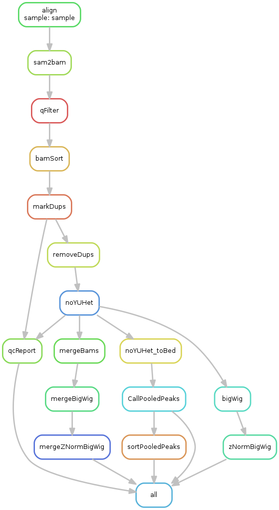

# McKayLab FAIRE Pipeline version 3.0
## Authors: Spencer Nystrom, Chris Uyehara, Jayashree Kumar
## Date: 2016-01-12

### Description
**Pipeline Steps:**



**Outputs**:

	- Raw bamfile for each sample
	- Bam & bed files filtered for MAPQ > 5, sorted, removed PCR duplicates, removed reads mapping to chrY, U, or heterochromatic regions for each sample and pooled samples
	- Bigwigs for each sample and all samples pooled
	- zNormalized Bigwigs for each sample and pooled samples
	- pooled macs2 peak calls & a bedfile of peaks sorted descending by qValue with only chr, start, end, name, qValue
	- Will **NOT** pool peaks or create pooled files if there are no files to pool.

### Usage:
**Ideal Directory Structure**
```{bash}
Project_Dir
├── <genotype>-<time>-<tissue>-FAIRE
│   ├── <sample>_rep1.fastq.gz
│   └── <sample>_rep2.fastq.gz
└── src
    └──	faire-pipeline/
		├── clusterConfig
		│   └── slurmConfig.json
		├── docs
		│   └── dag.png
		├── ReadMe.md
		├── slurmSubmission.sh
		├── Snakefile
		├── zNorm.r
		└── z_norm_v2.py
  
```

1. Make project directory
1. Clone repository into src/
1. change `GenomeAssembly` if necessary (Currently only supports dm3)
1. Create directories for each sample
	* Copy or symlink fastq.gz files (pool technical replicate fastq.gz or do read trimming first)
1. Inside each sample directory run: ` sh ../src/faire-pipeline/slurmSubmission.sh ` 
	- Job progress will be reported by snakemake. Progress can further be monitored by running `watch -n1 sacct -S now` in a separate terminal.
	- To manage job submission in background run ` nohup sh ../src/faire-pipeline/slurmSubmission.sh & disown`
	- To run on multiple directories (with 'FAIRE' in the names, in this example) at once, run: `for d in *FAIRE*; do cd $d ; nohup sh ../src/faire-pipeline/slurmSubmission.sh & disown ; cd .. ; done`
		- Snakemake output will be appended to nohup.out in each directory.
		- If you choose to run the pipeline this way, it is highly recommended you monitor job progress with `watch -n1 sacct -S <time you ran the pipeline>` to check for FAILED jobs.

**NOTE**: If not using submission script, you *must* provide the path to the snakefile as the first call to snakemake:
`snakemake --snakefile <path/to/Snakefile>`

### Requirements:
	- pysam (python2.7)
	- pyBigWig (python2.7)
	- snakemake (python3)
	- multiqc (python3)
	- rtracklayer (r, bioconductor)	
**Note**: 

On longleaf python packages can be installed locally with ` pip install --user <packageName> ` (use pip3 for python3 modules)

rtracklayer is preinstalled on longleaf


# ToDo:
	- Update DAG to reflect new changes & dynamic filenumber detection
	- Call range of peaks for QC analysis
		- Ideally, perhaps another pipeline for determining optimal number of peaks
			as determined by the sample with lowest ideal peak # in a set of peaks that will be compared
	- Add support for dm6
	- symlink to .faire-pipeline could cause problems if force rerunning pipeline and want to force recreation. Need to think of a robust solution to this.
